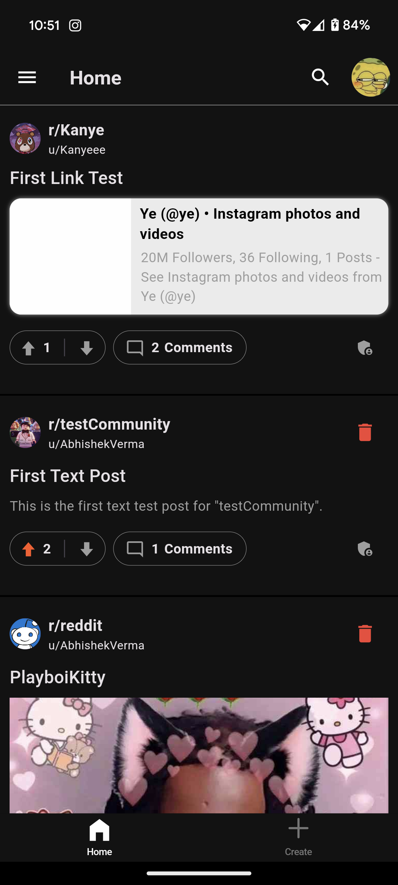
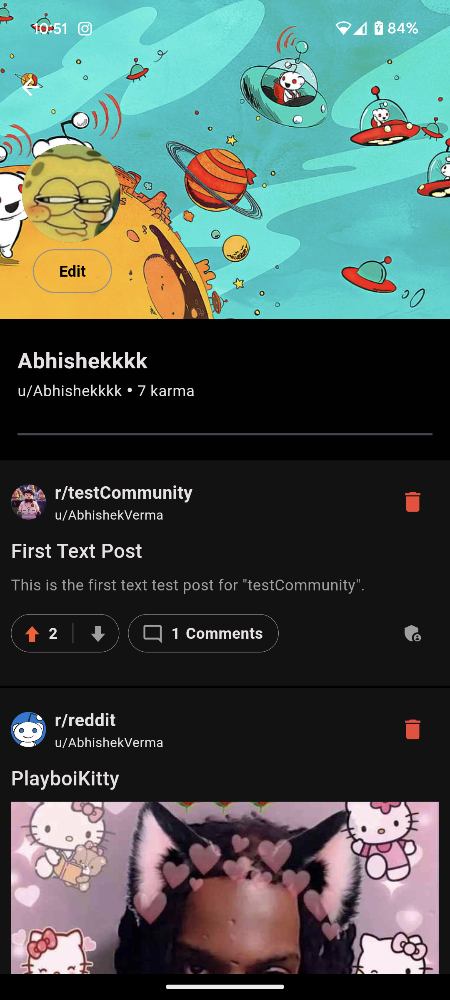
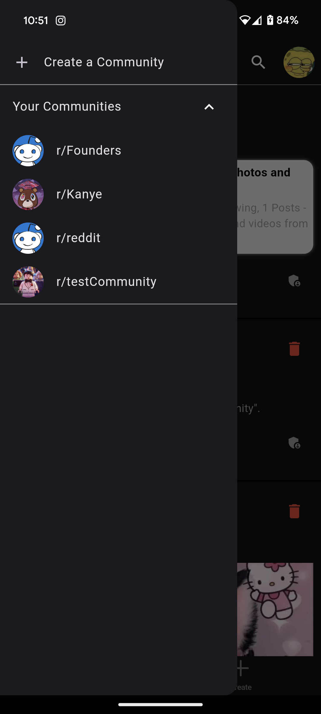

# Flutter Reddit Clone

This is a Reddit clone application built with Flutter, utilizing Firebase and Riverpod for state
management. The app aims to provide a Reddit-like experience where users can create communities,
join existing ones, and engage in discussions.

## Features

- **User Authentication**: Users can sign in with their Google accounts.
- **Community Creation**: Authenticated users can create new communities.
- **Community Search**: Users can search for existing communities.
- **Join/Leave Communities**: Users can join and leave communities.
- **Community Management**: Community creators have access to moderator tools to manage their
  communities, including editing the community profile and banner.
- **Firebase Integration**:
- Firebase Authentication for user authentication.
- Cloud Firestore for storing user data and community information.
- Firebase Storage for storing community banners and profile pictures.
- **State Management**: Riverpod is used for efficient state management throughout the application.

## Technologies Used

- Flutter
- Google SignIn
- Firebase Authentication
- Cloud Firestore
- Firebase Storage
- Riverpod (State Management)

## Screenshots

- Login
  
- Home
  
- User Profile
  
- Edit User Profile
  
- Comment Section
  
- Community Drawer
  